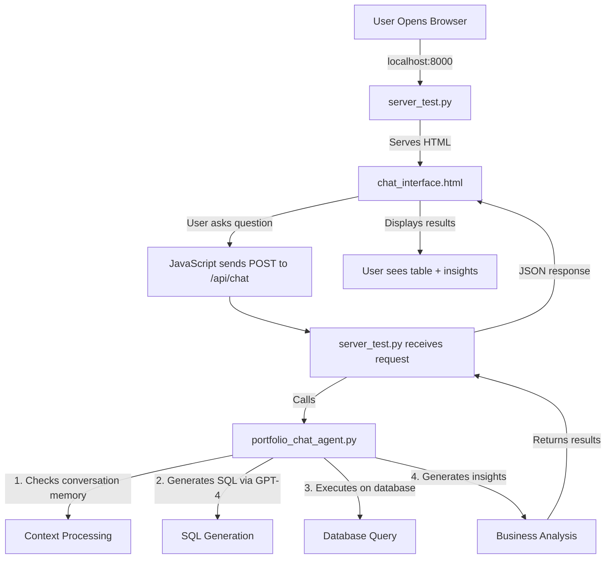

# 🏢 Real Estate AI Portfolio Assistant

> **Intelligent Conversational Analytics Platform for Private Equity Real Estate**  
> Transform complex portfolio data into actionable insights through natural language

[](https://www.python.org/)
[](https://fastapi.tiangolo.com/)
[](https://openai.com/)
[](https://www.microsoft.com/sql-server)

## 📋 Table of Contents
- [Executive Summary](#executive-summary)
- [Key Features](#key-features)
- [File Structure & Execution Flow](#file-structure--execution-flow)
- [Technical Architecture](#technical-architecture)
- [Data Warehouse Design](#data-warehouse-design)
- [AI Intelligence Layer](#ai-intelligence-layer)
- [Business Analytics](#business-analytics)
- [API Documentation](#api-documentation)
- [Setup & Installation](#setup--installation)

## 🎯 Executive Summary

The Real Estate AI Portfolio Assistant is a production-ready conversational analytics platform that revolutionizes how private equity professionals interact with portfolio data. By leveraging advanced LLMs and a custom-designed data warehouse, it transforms natural language queries into sophisticated SQL analyses with actionable business insights.

### 🚀 Key Innovation
Seamless translation from questions like *"Show me our best performing multifamily assets"* into optimized SQL queries with contextual business intelligence, powered by OpenAI GPT-4 and a custom real estate data warehouse.

## 📁 File Structure & Execution Flow

### Core Files Overview

```
real-estate-ai-assistant/
├── src/
│   ├── api/
│   │   └── server_test.py          # Main API server (Entry point)
│   ├── agents/
│   │   └── portfolio_chat_agent.py # AI chat agent logic
│   └── templates/
│       └── chat_interface.html     # Frontend UI
├── config/
│   └── openai_config.py           # API key configuration
└── requirements.txt                # Python dependencies
```

### Detailed File Descriptions & Execution Flow

#### 1️⃣ **server_test.py** (Main Entry Point)
**Location:** `src/api/server_test.py`  
**Purpose:** FastAPI server that orchestrates the entire application

**Key Responsibilities:**
- Initializes the FastAPI application on port 8000
- Loads the portfolio chat agent on startup
- Serves the HTML interface at root endpoint (`/`)
- Handles all API requests (chat, downloads, email)
- Manages conversation state and query results

**Execution Command:**
```bash
cd src/api
python server_test.py
```

**Key Functions:**
- `initialize_chat_agent()` - Loads AI agent with OpenAI key
- `/api/chat` endpoint - Processes natural language queries
- `/api/download/{format}` - Generates CSV/Excel/PDF exports
- `/api/send-email` - Sends reports via email

#### 2️⃣ **portfolio_chat_agent.py** (AI Brain)
**Location:** `src/agents/portfolio_chat_agent.py`  
**Purpose:** Core AI logic for query processing

**Key Responsibilities:**
- Natural language understanding
- SQL query generation using GPT-4
- Conversation memory management
- Business insights generation
- Spelling correction and context tracking

**Triggered By:** server_test.py during initialization and for each chat request

**Key Classes & Methods:**
```python
class PortfolioChatAgent:
    def __init__(self, openai_api_key)     # Initialize with API key
    def chat(self, user_question)          # Main chat interface
    def _generate_intelligent_sql(question) # Convert NL to SQL
    def _generate_business_insights(data)   # Create insights
```

#### 3️⃣ **chat_interface.html** (Frontend UI)
**Location:** `src/templates/chat_interface.html`  
**Purpose:** User interface for interacting with the AI

**Key Features:**
- Real-time chat interface
- Sample question sidebar
- Data table visualization
- Download options (CSV, Excel, PDF)
- Email report functionality
- Edit & rerun capability

**Served By:** server_test.py at root endpoint (`http://localhost:8000`)

### Execution Flow Diagram



## ✨ Key Features

### Core Capabilities
- 🤖 **Natural Language to SQL** - High accuracy query generation
- 💭 **Conversation Memory** - Contextual follow-up questions
- 📊 **Financial Metrics** - Real-time IRR, MOIC, NOI calculations
- 📁 **Multi-Format Export** - CSV, Excel, PDF with distribution
- 📧 **Email Integration** - Scheduled reports with attachments
- ✏️ **Edit & Rerun** - Iterative query refinement

## 🛠️ Setup & Installation

### Prerequisites
- Python 3.10+
- SQL Server database with real estate schema
- OpenAI API key

### Step-by-Step Setup

1. **Clone Repository**
```bash
git clone https://github.com/yourusername/real-estate-ai-assistant.git
cd real-estate-ai-assistant
```

2. **Install Dependencies**
```bash
pip install -r requirements.txt
```

3. **Configure API Keys**
Create `config/openai_config.py`:
```python
def get_openai_api_key():
    return "your-openai-api-key-here"
```

4. **Configure Database**
Update database connection in `portfolio_chat_agent.py`:
```python
# Line 34-35 in portfolio_chat_agent.py
self.db = EnhancedDatabaseConnection()  # Configure your connection
```

5. **Run the Application**
```bash
cd src/api
python server_test.py
```

6. **Access the Interface**
Open browser and navigate to:
```
http://localhost:8000
```

### File Dependencies Chain

```
server_test.py (Entry Point)
    ├── Imports portfolio_chat_agent.py
    │   ├── Uses config/openai_config.py (API key)
    │   ├── Uses database/enhanced_connection.py
    │   └── Uses config/system_prompts.py
    ├── Serves templates/chat_interface.html
    └── Optional: utils/download_utils.py (for exports)
                 utils/email_utils.py (for email)
```

## 🏗️ Technical Architecture

### System Components

```
┌─────────────────────────────────────────────────────────┐
│                    Frontend Layer                        │
│         (chat_interface.html - JavaScript ES6)          │
└──────────────────────┬──────────────────────────────────┘
                       │
┌──────────────────────▼──────────────────────────────────┐
│                    API Gateway                           │
│              (server_test.py - FastAPI)                 │
└──────────────────────┬──────────────────────────────────┘
                       │
┌──────────────────────▼──────────────────────────────────┐
│                  AI Agent Layer                          │
│        (portfolio_chat_agent.py - GPT-4)                │
└──────────────────────┬──────────────────────────────────┘
                       │
┌──────────────────────▼──────────────────────────────────┐
│                    Data Layer                            │
│      (SQL Server, Star Schema, 15 Tables)               │
└─────────────────────────────────────────────────────────┘
```

## 🗄️ Data Warehouse Design

### Schema Architecture
Modified star schema optimized for real estate private equity operations

### Dimension Tables (8)
| Table | Purpose | Key Attributes |
|-------|---------|----------------|
| **DimAsset** | Property information | Location, type, size, acquisition |
| **DimFund** | Investment funds | Strategy, commitments, returns |
| **DimInvestor** | Limited partners | Type, preferences, capacity |
| **DimLender** | Debt providers | Criteria, pricing, relationships |

### Fact Tables (7)
| Table | Business Purpose | Key Metrics |
|-------|-----------------|-------------|
| **FactAssetOperations** | Property performance | NOI, Revenue, Occupancy |
| **FactInvestment** | Fund investments | IRR, MOIC, Valuations |
| **FactDebtIssued** | Debt arrangements | LTV, DSCR, Balances |
| **FactInvestorReturns** | LP tracking | DPI, RVPI, TVPI |

## 📚 API Documentation

### Core Endpoints (Handled by server_test.py)

#### Chat Interface
```http
POST /api/chat
Content-Type: application/json

{
  "question": "Show me top performing multifamily assets"
}
```

#### Export Data
```http
POST /api/download/{format}
Formats: csv | excel | pdf
```

#### Email Report
```http
POST /api/send-email
```

## 🙏 Acknowledgments

- OpenAI for GPT-4 API
- FastAPI community
- Real estate domain experts who provided insights

## 📞 Contact

**Maniteja Kurukunda**  
AI & Data Engineering Professional  
Specializing in Financial Services & Real Estate Analytics

- Email: manitejakurukunda@gmail.com
- LinkedIn: https://www.linkedin.com/in/maniteja-kurukunda-64b7011a1/

---

<p align="center">
  Built with ❤️ for the Real Estate Private Equity Industry
</p>
